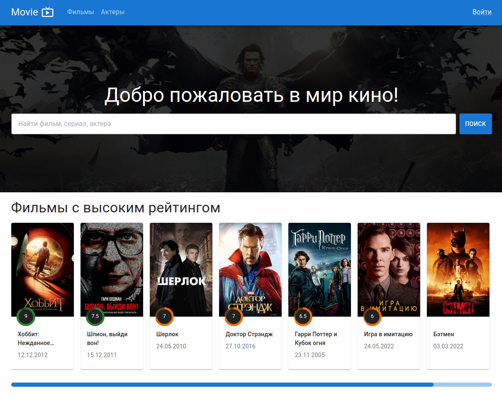

# Приложение Movie-App

В этом проекте реализована часть функционала сайта [TMDB](https://www.themoviedb.org/). Также есть админ панель для редактирования фильмов и актеров. 

### Backend
REST API для работы с фильмами, актерами и героями фильмов.

Написан на express.js.

В качестве базы данных и хранилища используются Firebase Cloud Firestore и Firebase Cloud Storage.

Авторизация реализована через JWT.

### Frontend
Написан на языке typescript с помощью React.

## Демо

В [приложении](https://movie-app-frontend-sigma.vercel.app/) доступны 3 пользователя:
1. email: `user1@user.com` пароль: `user1` роль: `менеджер`
2. email: `user2@user.com` пароль: `user2` роль: `пользователь`
3. email: `user3@user.com` пароль: `user3` роль: `пользователь`

## Запуск
Чтобы локально запустить сервер, в корне проекта выполните:
1. Переименуйте файлы `server/.env.sample` и `client/.env.sample` на `server/.env` и `client/.env` и пропишите необходимые параметры.
2. В каждой директории (`server` и `client`) выполнить `npm install`
3. В корне проекта выполнить `npm install` и `npm run dev`
